# FastShip 🚚

FastShip is a **B2B2C delivery management platform** that connects **Sellers** with **Delivery Partners**, providing **automatic assignment**, **real-time shipment tracking**, and **customer notifications** (Email/SMS) with **secure delivery verification**.

---

## Table of Contents

- [What FastShip does](#what-fastship-does)
- [How it works](#how-it-works)
- [Business Rules](#business-rules)
- [Data Model](#data-model)
- [Tech Stack](#tech-stack)
- [Quickstart (Docker)](#quickstart-docker)
- [Configuration](#configuration)
- [API Examples](#api-examples)
- [API Endpoints](#api-endpoints)
- [Project Structure](#project-structure)
- [Development](#development)
- [License](#license)

---

## What FastShip does

### 🏪 Sellers
- Register and verify email
- Create shipments
- Share a public tracking link with customers
- View shipment history and cancel shipments (when allowed)

### 🚛 Delivery Partners
- Register with serviceable zip codes and capacity limits
- Receive shipments automatically based on destination + availability
- Update shipment status & location in real-time
- View assigned shipments

### 👥 Customers
- Track shipments via **public tracking link**
- Receive email/SMS notifications at key stages
- Receive a verification code for secure delivery handover
- Submit a review after delivery completion (no login required)

---

## How it works

### 1) System overview

```mermaid
flowchart LR
  Seller[🏪 Seller] -->|Create shipments| API[FastAPI API]
  Partner[🚛 Delivery Partner] -->|Update status| API
  Customer[👥 Customer] -->|Track shipment| API

  API --> DB[(PostgreSQL)]
  API --> Cache[(Redis)]
  API --> Queue[Celery Queue]

  Queue --> Worker[Celery Worker]
  Worker --> SMTP[SMTP Email]
  Worker --> Twilio[Twilio SMS]
```



> Mermaid diagrams render on GitHub. For maximum compatibility across platforms, you can also
> export diagrams to PNG/SVG and place them in `docs/diagrams/` as image fallbacks.

### 2) Shipment lifecycle


### 3) Auto-assignment (Seller creates shipment)


### 4) Status updates + verification + notifications


---

## Business Rules

- **Max weight:** 25kg
- **Status lifecycle:**
  - `placed` → `in_transit` → `out_for_delivery` → `delivered`
  - Or `cancelled`
- **Partner assignment:**
  - Destination zip must be in partner’s **serviceable locations**
  - Partner must have remaining **capacity** (concurrent shipments)
- **Delivery verification:**
  - On `out_for_delivery`, system generates a **6-digit code** and stores it in Redis (recommended TTL)
  - Marking `delivered` requires the correct code
- **Review:**
  - Exactly **1 review per shipment**
  - Allowed only after `delivered`
  - Submitted via **secure token link** (no login)

---

## Data Model

README-friendly ERD (relationships only):


---

## Tech Stack

- **FastAPI** (API)
- **SQLModel + SQLAlchemy** (ORM)
- **PostgreSQL** (primary database)
- **Alembic** (migrations)
- **Redis** (verification codes, Celery broker/result backend)
- **Celery** (async notifications)
- **SMTP** (email delivery)
- **Twilio** (SMS delivery)
- **Docker + Docker Compose** (local/dev deployment)

---

## Quickstart (Docker)

### Prerequisites
- Docker + Docker Compose

### 1) Create `.env`
Create a `.env` file in the repo root (see [Configuration](#configuration)).

### 2) Start services

```bash
docker compose up -d --build
docker compose exec api alembic upgrade head
```

### 3) Open API docs
- Swagger: http://localhost:8000/docs

> If your compose maps DB to a non-default port (e.g. 5433), verify it in `compose.yaml`.

---

## Configuration

Create a `.env` file in the project root:

```env
# Database
POSTGRES_SERVER=db
POSTGRES_PORT=5432
POSTGRES_USER=postgres
POSTGRES_PASSWORD=strong
POSTGRES_DB=fastship

# Redis
REDIS_HOST=redis
REDIS_PORT=6379

# Security
JWT_SECRET=your-secret-key-here
JWT_ALGORITHM=HS256

# Email (SMTP)
MAIL_USERNAME=your-email@gmail.com
MAIL_PASSWORD=your-app-password
MAIL_FROM=your-email@gmail.com
MAIL_FROM_NAME=FastShip
MAIL_PORT=587
MAIL_SERVER=smtp.gmail.com
MAIL_STARTTLS=True
MAIL_SSL_TLS=False
USE_CREDENTIALS=True
VALIDATE_CERTS=True

# SMS (Twilio)
TWILIO_SID=your-twilio-sid
TWILIO_AUTH_TOKEN=your-twilio-auth-token
TWILIO_NUMBER=+1234567890

# App
APP_DOMAIN=localhost:8000
```

---

## API Examples

### Seller login

```bash
curl -X POST http://localhost:8000/seller/token \
  -H "Content-Type: application/x-www-form-urlencoded" \
  -d "username=SELLER_EMAIL&password=SELLER_PASSWORD"
```

### Create shipment (seller)

```bash
curl -X POST http://localhost:8000/shipment/ \
  -H "Authorization: Bearer <SELLER_JWT>" \
  -H "Content-Type: application/json" \
  -d '{
    "client_contact_email": "customer@example.com",
    "client_contact_phone": "+3725555555",
    "content": "Shoes",
    "weight": 1.2,
    "destination": 10115,
    "estimated_delivery": "2026-01-15T12:00:00"
  }'
```

### Public tracking

```bash
curl "http://localhost:8000/shipment/track?id=<SHIPMENT_ID>"
```

---

## API Endpoints

### Seller
- `POST /seller/signup` — Register
- `POST /seller/token` — Login (OAuth2)
- `GET /seller/me` — Profile
- `GET /seller/shipments` — List shipments
- `GET /seller/verify` — Verify email
- `GET /seller/forgot_password` — Request reset
- `POST /seller/reset_password` — Reset password
- `GET /seller/logout` — Logout

### Delivery Partner
- `POST /partner/signup` — Register
- `POST /partner/token` — Login (OAuth2)
- `GET /partner/me` — Profile
- `GET /partner/shipments` — Assigned shipments
- `POST /partner/` — Update partner profile
- `GET /partner/verify` — Verify email
- `GET /partner/forgot_password` — Request reset
- `POST /partner/reset_password` — Reset password
- `GET /partner/logout` — Logout

### Shipment
- `POST /shipment/` — Create (Seller)
- `GET /shipment/` — Get details
- `PATCH /shipment/` — Update status (Partner)
- `GET /shipment/track` — Public tracking page
- `GET /shipment/tag` — Add tag
- `DELETE /shipment/tag` — Remove tag
- `GET /shipment/cancel` — Cancel (Seller)
- `POST /shipment/review` — Submit review (token)

---

## Project Structure

```
fastship/
├── app/
│   ├── api/                    # Routers, schemas, dependencies
│   ├── core/                   # Security, logging, exceptions
│   ├── database/               # Models, sessions, redis
│   ├── services/               # Business logic layer
│   ├── worker/                 # Celery tasks
│   ├── templates/              # Email templates
│   ├── tests/                  # Tests
│   ├── config.py               # Settings
│   └── main.py                 # FastAPI app
├── migrations/                 # Alembic migrations
├── compose.yaml                # Docker Compose
├── Dockerfile
├── requirements.txt
└── README.md
```

---

## Development

### Local (without Docker for API)
Recommended Python: **3.11+** (or match your project requirements)

```bash
python -m venv venv
source venv/bin/activate
pip install -r requirements.txt
```

Run dependencies via Docker:

```bash
docker compose up -d db redis
```

Run migrations + start API:

```bash
alembic upgrade head
fastapi run --port 8000
```

Run Celery worker:

```bash
celery -A app.worker.tasks worker --loglevel=info
```

---

## License

Add your license information here.
