# FastShip 🚚

FastShip is a **B2B delivery management platform** that connects **Sellers** with **Delivery Partners**.  
It supports **auto-assignment**, **public tracking**, **recipient notifications (Email/SMS)**, and **secure delivery verification**.

---

## What it is

**Actors**
- **Seller**: creates shipments and shares tracking link
- **Delivery Partner**: delivers shipments and updates statuses
- **Recipient**: tracks shipment via public link (no account)

---

## Business model (high-level)

```mermaid
flowchart TB
  Seller[🏪 Sellers] -->|Pay subscription / per-shipment| FastShip[FastShip Platform]
  FastShip -->|Work orders + tracking + notifications| Seller

  FastShip -->|Assigned shipments| Partner[🚛 Delivery Partners]
  Partner -->|Delivery updates| FastShip

  FastShip -->|Tracking + notifications| Recipient[📦 Recipients]
```



**Monetization options**
- Subscription tiers for Sellers (shipments included)
- Usage-based fee per shipment / per SMS
- Optional marketplace fee on completed deliveries (if you run a partner network)
- Premium add-ons: SLA/analytics, white-label tracking, priority assignment

---

## Business flow (how it works)


### Shipment lifecycle


---

## Tech overview


**Key ideas**
- Postgres = system of record (shipments + timeline/events)
- Redis = short-lived data (verification codes, token blacklist, Celery broker/backend)
- Celery = async notifications (non-blocking)

---

## Tech stack

- **FastAPI**
- **PostgreSQL**
- **SQLModel / SQLAlchemy**
- **Alembic**
- **Redis**
- **Celery**
- **SMTP** (email), **Twilio** (SMS)
- **Docker + Docker Compose**

---

## Project structure

```
fastship/
├── app/
│   ├── api/            # Routes + request/response schemas
│   ├── core/           # Security, settings, exceptions, logging
│   ├── database/       # DB models, sessions, redis client
│   ├── services/       # Business logic (assignment, events, reviews)
│   ├── worker/         # Celery tasks
│   ├── templates/      # Email + HTML templates (tracking/review)
│   ├── tests/          # Tests
│   ├── config.py       # App configuration
│   └── main.py         # FastAPI app entrypoint
├── migrations/         # Alembic migrations
├── compose.yaml        # Local stack
├── Dockerfile
├── requirements.txt
└── README.md
```

---

## Quickstart (Docker)

1) Create `.env` (see below)  
2) Start everything:
```bash
docker compose up -d --build
```
3) Run migrations:
```bash
docker compose exec api alembic upgrade head
```
4) Open docs:
- `http://localhost:8000/docs`

---

## Configuration

Create `.env` in repo root:

```env
# Database
POSTGRES_SERVER=db
POSTGRES_PORT=5432
POSTGRES_USER=postgres
POSTGRES_PASSWORD=strong
POSTGRES_DB=fastship

# Redis
REDIS_HOST=redis
REDIS_PORT=6379

# Security
JWT_SECRET=your-secret-key-here
JWT_ALGORITHM=HS256

# Email (SMTP)
MAIL_USERNAME=your-email@gmail.com
MAIL_PASSWORD=your-app-password
MAIL_FROM=your-email@gmail.com
MAIL_FROM_NAME=FastShip
MAIL_PORT=587
MAIL_SERVER=smtp.gmail.com
MAIL_STARTTLS=True
MAIL_SSL_TLS=False

# SMS (Twilio)
TWILIO_SID=your-twilio-sid
TWILIO_AUTH_TOKEN=your-twilio-auth-token
TWILIO_NUMBER=+1234567890

# App
APP_DOMAIN=localhost:8000
```

---

## Development

### Run infra only (DB + Redis)
```bash
docker compose up -d db redis
```

### Run API locally
```bash
python -m venv venv
source venv/bin/activate
pip install -r requirements.txt
alembic upgrade head
fastapi run --port 8000
```

### Run worker
```bash
celery -A app.worker.tasks worker --loglevel=info
```

---

## License

Add a `LICENSE` file (MIT / Apache-2.0 / etc.)
